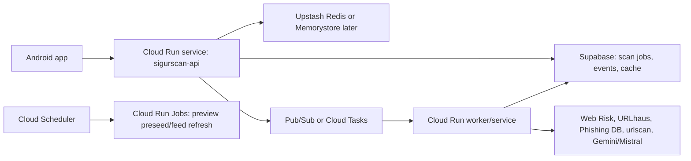

# SigurScan Cloud Run Migration Plan

Decision: Cloud Run is the commercial backend target for SigurScan.

Vercel remains useful for static pages or a tiny admin/landing surface, but the scan engine should move to Cloud Run because SigurScan needs containerized API code, predictable request timeout, jobs, queues, and worker-style enrichment.

## Target Architecture



## What Runs Where

- `sigurscan-api`: FastAPI HTTP service from `backend/main.py`.
- `sigurscan-worker`: future worker container for slow enrichment, urlscan polling, claim verification, OCR, and preview refresh.
- `sigurscan-precapture`: existing Playwright pre-capture worker as Cloud Run Job.
- Supabase remains the source of truth for scans, telemetry, preview cache, and storage.
- Upstash Redis can remain for rate limiting and short-lived locks.

## Why Cloud Run

- Runs Docker containers.
- Request timeout defaults to 5 minutes and can be configured up to 60 minutes.
- Jobs support long task timeouts.
- Scales to zero for low traffic.
- Works naturally with Google Web Risk, Gemini, Cloud Logging, Cloud Scheduler, Pub/Sub and Cloud Tasks.

## First Production Cut

1. Deploy current FastAPI backend as `sigurscan-api`.
2. Keep existing Supabase tables and secrets.
3. Keep current API behavior initially, but remove Vercel-specific assumptions.
4. Use Cloud Run timeout 300s at first, not because requests should run that long, but to avoid accidental Vercel-style kills while we migrate.
5. Then split slow work into a worker:
   - urlscan submit/poll
   - preview enrichment
   - AI claim web verification
   - OCR where it is slow

## Required Google Cloud Setup

Enable:

- Cloud Run
- Cloud Build
- Artifact Registry
- Secret Manager
- Cloud Logging
- Pub/Sub or Cloud Tasks later
- Cloud Scheduler later

Recommended region:

- `europe-west1` for Belgium/EU
- alternative: `europe-west3` Frankfurt, if quotas and services are better there

## Secrets

Use Secret Manager, not plain repo files.

Needed secrets:

- `SUPABASE_URL`
- `SUPABASE_SERVICE_ROLE_KEY`
- `GOOGLE_WEB_RISK_API_KEY`
- `URLHAUS_AUTH_KEY`
- `SIGURSCAN_URLSCAN_API_KEY`
- `GEMINI_API_KEY`
- `MISTRAL_API_KEY`
- `UPSTASH_REDIS_REST_URL`
- `UPSTASH_REDIS_REST_TOKEN`
- `SIGURSCAN_API_KEYS`
- `SIGURSCAN_ADMIN_API_KEYS`

## Deploy Backend

From repo root:

```bash
PROJECT_ID="your-gcp-project" \
REGION="europe-west1" \
./tools/deploy_cloud_run_backend.sh
```

The script builds `backend/Dockerfile`, pushes it to Artifact Registry, and deploys `sigurscan-api`.

## Cost Control

Start with:

- `--max-instances 5`
- `--cpu 1`
- `--memory 1Gi`
- no minimum instances until latency demands it
- Google Cloud billing budget alert

If cold starts hurt Android UX, set `min-instances=1` only after we understand cost.

## Migration Order

1. Containerize and deploy `sigurscan-api`.
2. Smoke test health + one clean URL + one malicious control.
3. Point Android debug build to Cloud Run URL.
4. Move slow enrichments into worker/queue.
5. Keep Vercel as fallback until Cloud Run has passed live smoke.
6. Update production Android base URL.

## What Not To Do

- Do not run Playwright screenshots inside the user-facing API request.
- Do not keep Vercel polling logic as the final worker model.
- Do not put secrets in `.env` committed to git.
- Do not rely on request timeout as architecture. Long timeout is a safety net, not the design.
